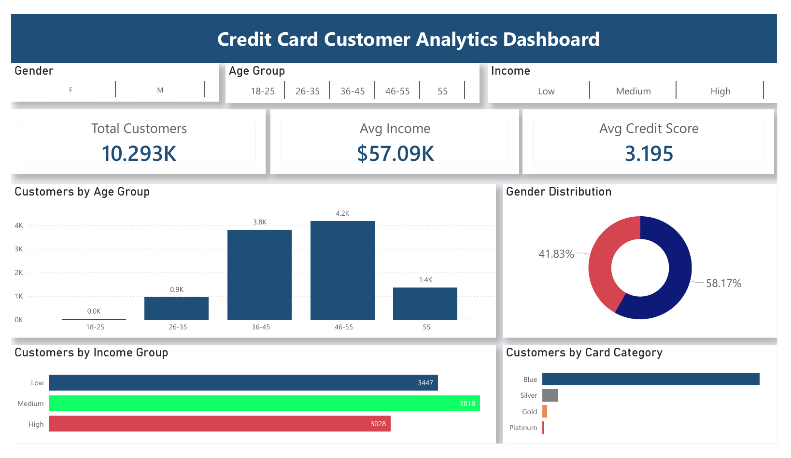
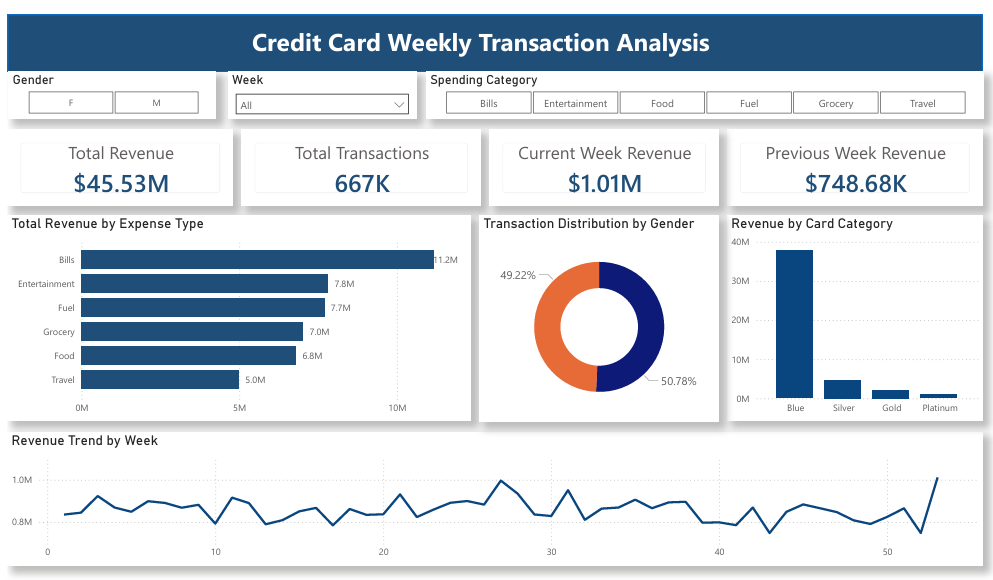

# Credit Card Financial Analytics Dashboard

## 📊 Project Overview
This project includes two interactive Power BI dashboards:

1. Credit Card Customer Analytics Dashboard
2. Credit Card Weekly Transaction Analysis Dashboard

The dashboards provide insights into customer demographics, revenue trends, transaction behavior, and spending categories.

---

## 🎯 Objectives

- Analyze credit card customers by Gender, Age Group, and Income Group
- Track weekly revenue performance
- Compare current week vs previous week revenue
- Identify top spending categories
- Monitor transaction volume trends

---

## 🗂 Datasets Used

1. Customer Dataset
2. Credit Card Weekly Transaction Dataset

---

## 📈 Dashboard 1: Customer Report

Key Metrics:
- Total Customers
- Average Income
- Average Credit Score

Filters:
- Gender
- Age Group
- Income Group

---

## 📉 Dashboard 2: Transaction Report

Key Metrics:
- Total Revenue
- Total Transactions
- Current Week Revenue
- Previous Week Revenue

Filters:
- Gender
- Week Number
- Spending Category

---

## 🛠 Tools & Technologies

- Power BI Desktop
- DAX
- Power Query
- Data Modeling

---

## 📷 Dashboard Screenshots

### Customer Dashboard

### Transaction Dashboard

---

## 🚀 How to Use

1. Download the .pbix file
2. Open in Power BI Desktop
3. Interact using slicers

---

## 📌 Author
Mayuri Datir
